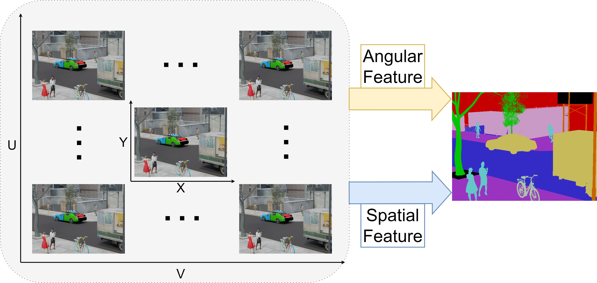

OAFuser： Towards Omni-Aperture Fusion for Light Field Semantic Segmentation of Road Scenes

 

  Fei&nbsp;Teng</a> <b>&middot;</b>
  <a href="https://www.researchgate.net/profile/Jiaming-Zhang-10" target="_blank">Jiaming&nbsp;Zhang</a> <b>&middot;</b>
  <a href="https://www.researchgate.net/profile/Kunyu-Peng" target="_blank">Kunyu&nbsp;Peng</a> <b>&middot;</b>
  <a href="https://www.researchgate.net/profile/Kailun-Yang" target="_blank">Kailun&nbsp;Yang</a> 
<b>&middot;</b>
  <a href="https://www.researchgate.net/profile/Yaonan-Wang" target="_blank">Yaonan&nbsp;Wang</a> 
<b>&middot;</b>
  <a href="https://www.researchgate.net/profile/Rainer-Stiefelhagen" target="_blank">Rainer&nbsp;Stiefelhagen</a>

  

  <a href="https://github.com/FeiBryantkit/OAFuser" target="_blank">Paper</a>

# 

:hammer_and_wrench: :construction_worker: :rocket:

:fire: We will release code and checkpoints in the future. :fire:

### Update

- 2023.07.29 Init repository.
- 2023.07.31 Release the [arXiv](https://arxiv.org/abs/2307.15588) version.

### TODO List

- [ ] Release the arXiv version.
- [ ] Code release. 

### Abstract

Light field cameras can provide rich angular and spatial information to enhance image semantic segmentation for scene understanding in the field of autonomous driving. However, the extensive angular information of light field cameras contains a large amount of redundant data, which is overwhelming for the limited hardware resource of intelligent vehicles. Besides, inappropriate compression leads to information corruption and data loss. To excavate representative information, we propose an Omni-Aperture Fusion model (OAFuser), which leverages dense context from the central view and discovers the angular information from sub-aperture images to generate a semantically-consistent result. To avoid feature loss during network propagation and simultaneously streamline the redundant information from the light field camera, we present a simple yet very effective Sub-Aperture Fusion Module (SAFM) to embed sub-aperture images into angular features without any additional memory cost. Furthermore, to address the mismatched spatial information across viewpoints, we present Center Angular Rectification Module (CARM) realized feature resorting and prevent feature occlusion caused by asymmetric information. 

### Method

    (Overview)

    

  

### Contact

Feel free to contact me if you have additional questions or have interests in semantic segmentation based on light field camera. Please drop me an email at tengfei_tf@outlook.com
